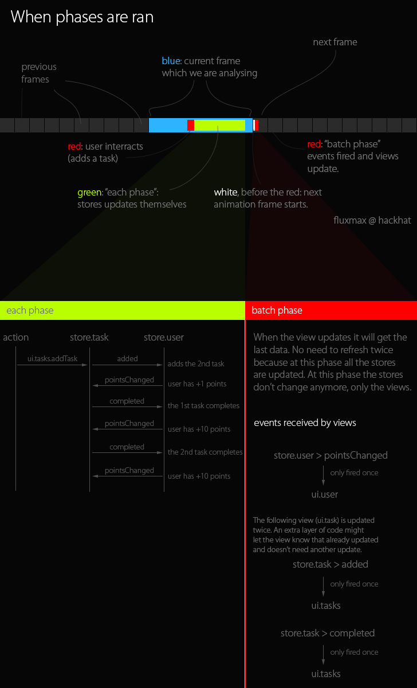

2 phase events: update stores then views. 1 way flow. Static event deps checker.

**Quick features:**

 - Update stores properly and naturally;
 - Static event deps checker and output (a typo in an event is caught at boot);
 - 1 way flow like flux by Facebook;

## Quick view about the 2 phase system

## Install

    npm install fluxmax --save-dev

## API

Check the **[full API here](https://cdn.rawgit.com/hackhat/fluxmax/v0.0.2/docs/jsduck/index.html)**.

## Rationale

To understand the power of fluxmax we need to use multiple stores which depends on themselves.

    Store A -> Store B
      |          |
      -<---<---<--

### Example

Solve a complex situation like the following can be handled easily (See [here the full source](https://github.com/hackhat/fluxmax-smart-css)):

**Rules:**

 - When a task is added the user gets 1 point;
 - When a task is done manually or automatically the user gets a random number of points;
 - Each task has a threshold which defines the minimum of points the user needs to have to complete automatically; When this threshold is reached the task auto completes.
 - When a task passes from completed to not complete the user lose the points;

**Flow:**

 - User adds a new task which auto completes when the user has 2 points;
 - On adding a task the user receives 1 point;
 - User adds another task which adds 1 point and auto completes when the user has 5 points.
   - Now the user has a total of 2 points;
   - The first task is done.
   - When the first task is done the user receives 10 points;
   - This will also complete the 2nd task because the user now has 12 points;

Can you see how this is not a simple job to do in flux. When this is done in flux the
code becomes complicated and doesn't feel natural, which increases the complexity of the app.

### How it doesn't update the view multiple times?

A naive way to solve these problems is to be able to make the store A to update store B and then store B to update store A.
But when store A changes the view updates so there is a problem: the store A changes twice after an action and the view that listen to the store A will update twice.
This will be an issue when the application grow. So here is how this library solves this problem.

#### Each phase

There is a first event phase which only the stores listen to, which is called the "each" phase. In this phase store A emits twice, but the view doesn't listen to the "each" phase so it doesn't get updated.

#### Batch phase

The second phase is the "batch" phase which gets called on the next animation frame and dispatches only one event from store A. So if the store A dispatched the event "test" twice with data `1` and then data `2` the view will only only receive one "test" event with data `[1, 2]`. Notice how you don't lose any data along while grouping the events from the "each" phase.

#### Deeper understanding

 The first phase is called `each` (because dispatches on `each` change) and the listeners receives the event as soon as it's dispatched. The second phase is called `batch` (because dispatches the events on `batch`) and the listeners receives the event only when the `Fluxmax.emitBatchChanges` method is called.

#### Dependencies

Fluxmax makes very easy to see how your app is wired internally, just open the console and you will see all the dependencies:

> Dependency defined in "store.task" on "actions" at type "ui.tasks.addTask" is valid. [each]

The first line says the `task` store listens on the entity `actions` on the event `ui.tasks.addTask`. The entity `actions` is used from the view/UI part of the app. The `[each]` part at the end tells that is listening on the `each phase`.

> Dependency defined in "ui.user" on "store.user" at type "*" is valid. [batch]

The last line says the the `ui.user` entity, which is the view of the user which contains the points, listens on `*` events (this means that listen to all the events) on the `user` store. Notice that at the end now says `[batch]`, this means that the view is listening on the `batch phase`.

## How to use

Is not very easy to get started and there are a lot of rules to make it work. Because of this a tutorial here would not be a good approach to explain how it works.
The best way to understand is to read the source code of the [fluxmax-smart-css](https://github.com/hackhat/fluxmax-smart-css).
